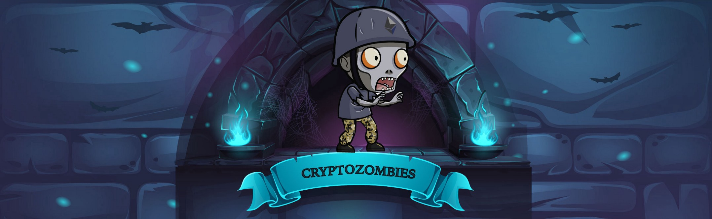

# CryptoZombies

## Index
- [👨🏼‍💻 Author](#-author)
- [🗣 Description](#-description)
- [🔎 Lessons](#-lessons)
- [📝 Directory structure](#-directory-structure)

 

## 👨🏼‍💻 Author
  - Eduardo Expósito Barrera - alu0101230382@ull.edu.es

 

## 🗣 Description
  - This repository contains the source codes of the [Cryptozombies](https://cryptozombies.io/en/) lessons.

 

## 🔎 Lessons
- In this section you will find the final result of each lesson.
  - **Lesson-1:** [Link](https://share.cryptozombies.io/es/lesson/1/share/Edu)
  - **Lesson-2:** [Link](https://share.cryptozombies.io/es/lesson/2/share/Edu?id=Y3p8MTk2NTYx)
  - **Lesson-3:** [Link](https://share.cryptozombies.io/es/lesson/3/share/Edu?id=Y3p8MTk2NTYx)
  - **Lesson-4:** [Link](https://share.cryptozombies.io/es/lesson/4/share/Edu?id=WyJjenwxOTY1NjEiLDEsMTRd)
  - **Lesson-5:** [Link](https://share.cryptozombies.io/es/lesson/5/share/H4XF13LD_MORRIS_%F0%9F%92%AF%F0%9F%92%AF%F0%9F%98%8E%F0%9F%92%AF%F0%9F%92%AF?id=Y3p8MTk2NTYx)
  - **Lesson-6:** [Link](https://share.cryptozombies.io/es/lesson/6/share/The_Phantom_of_Web3?id=Y3p8MTk2NTYx)

 

## 📝 Directory structure
- The directory is organized as follows:
  
      .
      ├── contracts
          ├── lesson-1
              ├── Contract.sol
          ├── lesson-2
              ├── zombiefactory.sol
              ├── zombiefeeding.sol
          ├── lesson-3
              ├── ownable.sol
              ├── zombiefactory.sol
              ├── zombiefeeding.sol
              ├── zombiehelper.sol
          ├── lesson-4
              ├── ownable.sol
              ├── zombieattack.sol
              ├── zombiefactory.sol
              ├── zombiefeeding.sol
              ├── zombiehelper.sol
          ├── lesson-5
              ├── erc721.sol
              ├── ownable.sol
              ├── safemath.sol
              ├── zombieattack.sol
              ├── zombiefactory.sol
              ├── zombiefeeding.sol
              ├── zombiehelper.sol
              ├── zombieownership.sol
          ├── lesson-6
              ├── erc721.sol
              ├── index.html
              ├── ownable.sol
              ├── safemath.sol
              ├── zombieattack.sol
              ├── zombiefactory.sol
              ├── zombiefeeding.sol
              ├── zombiehelper.sol
              ├── zombieownership.sol
      ├── img
          ├── cryptozombies.jpeg
